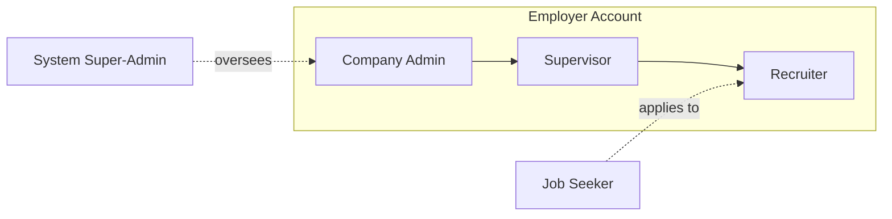
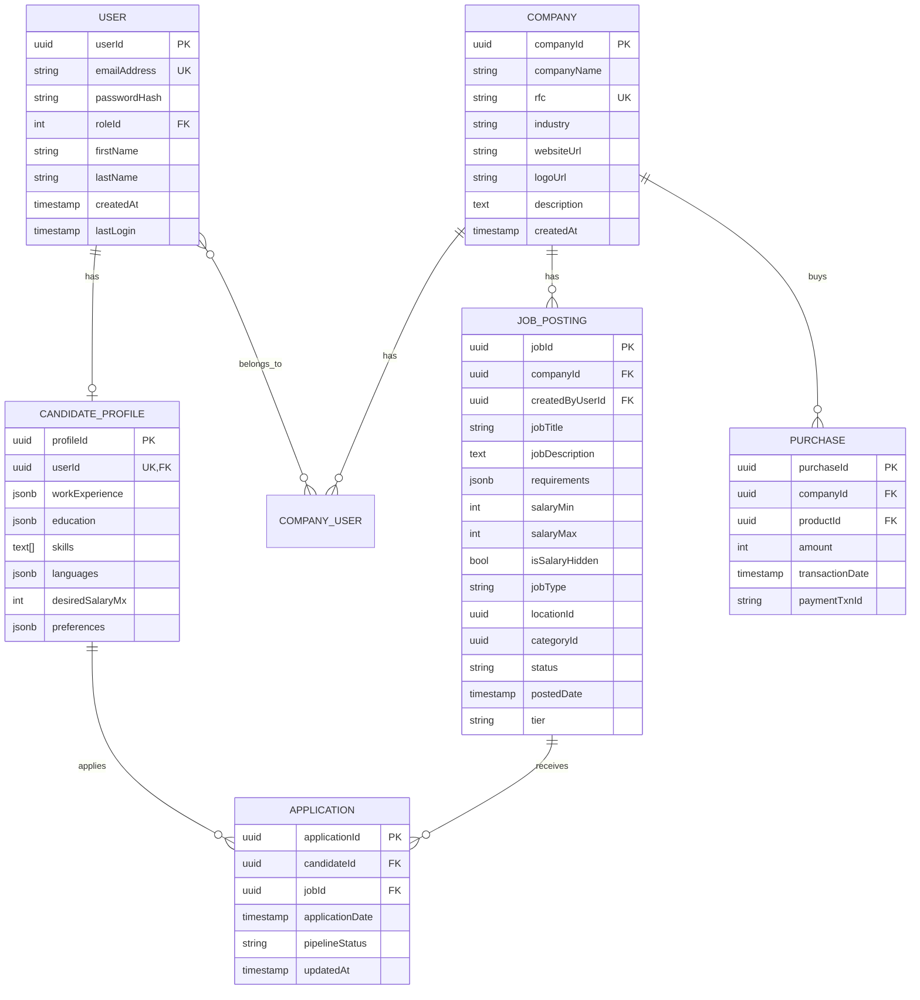

# TalentFlow Platform Blueprint

> Definitive technical and functional blueprint for architecture, design, and implementation.

## 0. Executive Summary

- Free, AI-powered career tools for Job Seekers (CV builder, recommendations, instant apply)
- Enterprise-grade suite for Employers (ATS, sourcing, analytics, monetization)
- Benchmarked against OCCMundial; differentiated via superior UX and AI
- Phased delivery ensuring early value and scalable evolution

---

## 1. Global Architecture and System-Wide Principles

### 1.1 User Roles and Permissions (RBAC)

Roles:
- Job Seeker (Candidate)
- Employer: Recruiter, Supervisor, Company Admin
- System Super-Admin (internal)

Key principles:
- Least-privilege defaults, resource scoping (by job, department, location)
- Enforcement at API and data layers
- Auditable permission checks and changes



Permissions matrix (abridged):

| Feature/Action | Job Seeker | Recruiter | Supervisor | Company Admin | Super-Admin |
|---|---|---|---|---|---|
| User Account | C/R/U/D Own | Read Own | Read Own | Read Own | C/R/U/D All |
| Candidate Profile (CV) | C/R/U/D Own | Read All | Read All | Read All | R/U/D All |
| Company Profile | Read Only | Read Only | Read Only | C/R/U/D | C/R/U/D All |
| Job Posting | Read Only | C/R/U/D Assigned | C/R/U/D Team | C/R/U/D All | C/R/U/D All |
| Job Application | C/R Own | R/U Assigned | R/U Team | R/U All | Read All |
| Talent DB Search | N/A | Execute | Execute | Execute | Execute |
| Unlock Contacts | N/A | Use Credits | Use/Assign | Use/Assign | N/A |
| Company User Mgmt | N/A | N/A | C/R/U/D Recruiters | C/R/U/D All | C/R/U/D All |
| Billing & Purchases | N/A | Read | Read | C/R/U | C/R/U All |
| Analytics | View Own | View Assigned | View Team | View All | View All |
| System Config | N/A | N/A | N/A | N/A | C/R/U/D |

### 1.2 Conceptual Data Model

Design decisions:
- Decouple `User` (auth) from functional profiles (e.g., `CandidateProfile`, `Company`)
- Use UUIDs for entities; enforce unique indexes on natural keys (emails, RFC)
- Store complex CV segments as JSONB for flexibility + secondary indexes for search



### 1.3 UI/UX Framework and Design System

- React SPA + SSR/SSG for public pages (Next.js recommended)
- Internal component library (analogous to `@occmundial/occ-atomic`): Buttons, Icons (SVG sprite), Inputs, Cards, Badges, Nav, Tables
- Principles: clarity, conversational flows for multi-step tasks, dense dashboards for power users, mobile-first responsive design

### 1.4 Non-Functional Requirements

- Security: TLS everywhere, bcrypt password hashing, RBAC at API, PII encryption at rest
- Performance: p50 API < 200 ms for core endpoints; LCP < 2.5s on key pages
- Scalability: cloud-native, horizontal scaling, CDN for static assets
- Availability: ≥ 99.9%; multi-AZ, health checks, monitoring/alerting
- I18n/L10n: ES-MX default; strings externalized for future locales

---

## 2. Job Seeker Experience

### 2.1 Onboarding & Profile

- Registration: email/password + Google/LinkedIn SSO; email verification gate for applying
- AI CV Wizard: step-by-step, assistant suggests bullets by title and experience; progress indicator
- Dashboard: recommendations, saved jobs, application status summary

### 2.2 Discovery & Search

- Prominent search (title/location), autosuggest; advanced filters (salary, location, category, company, posted date, contract, modality, education)
- Results: card list, tiered visual differentiation; pagination/infinite scroll

### 2.3 Application & Engagement

- Job details: full description, benefits, company info
- Instant Apply: one-click using latest CV; immediate confirmation
- Tracking: "Mis Postulaciones" with real-time statuses and "Who viewed your CV"
- Saved Jobs & Searches

### 2.4 Personalization & Notifications

- Recommendation engine: CV content, preferences, history, saved/applied signals
- Notifications: saved-search alerts, digests, real-time view events; email and push

---

## 3. Employer Experience

### 3.1 Corporate Onboarding & Account Mgmt

- Conversational onboarding; capture company data incl. RFC, industry, size; logo and description
- Public company profile page
- Team management: invite users, assign roles, edit/deactivate

### 3.2 Job Posting & Promotion

- Wizard with AI JD generator; fields for title, description, skills, experience, education, location, contract, modality, salary (hide option)
- Product tiers: Clásica, Destacada, Premium with visibility and branding features
- Jobs dashboard by status: Active, Draft, Expired, Filled

### 3.3 ATS

- Kanban pipeline by stages; drag-and-drop
- Advanced filters/sorts; candidate folders: Por revisar, Me interesan, Descartados
- Integrated CV viewer; team notes/comments/ratings; messaging with templates (bulk + individual)

Default pipeline stages:

| Order | ES | EN | Description |
|---:|---|---|---|
| 1 | Postulados (Nuevos) | New Applications | Default, awaiting review |
| 2 | En Revisión | Under Review | Actively reviewing |
| 3 | Contactado / Entrevista | Contacted / Interview | Outreach/interviews |
| 4 | Evaluaciones | Assessments | Tests/assessments |
| 5 | Oferta | Offer Extended | Offer sent |
| 6 | Contratado | Hired | Accepted offer |
| 7 | Descartado | Rejected | Terminal stage |

### 3.4 Proactive Talent Sourcing

- Talent DB search with powerful filters
- Contact Credits system: mask contacts, spend credits to reveal; bundled with tiers; purchasable add-ons
- AI suggested profiles for each new job

### 3.5 Analytics & Reporting

- Recruiter dashboard widgets; KPIs: funnel, Time to Fill, Time to Hire, source effectiveness, cost per hire, offer acceptance

---

## 4. Core Business & Admin

### 4.1 Monetization & E-commerce

- Public pricing for tiers and credit bundles
- Cart + checkout; collect fiscal data for invoicing (RFC, Razón Social, Régimen Fiscal)
- Payment gateways: Stripe/PayPal; local SPEI support
- Automated CFDI invoicing (post-payment)
- Entitlements ledger: posting slots per tier (with expiry), contact credit balances and allocation/consumption

Product tiers (illustrative):

| Feature | Clásica | Destacada | Premium |
|---|---|---|---|
| Price (MXN + IVA) | $1,499 | $1,799 | $2,199 |
| Visibility | 60 Days | 60 Days | 60 Days |
| Applicants CV View | Unlimited | Unlimited | Unlimited |
| Talent DB Search | Unlimited | Unlimited | Unlimited |
| Logo in Results | No | Yes | Yes |
| Highlight 3 Benefits | No | Yes | Yes |
| AI Candidate Suggestions | No | Yes | Yes |
| Priority in Results | No | No | Yes |
| "Recommended" Tag | No | No | Yes |
| 3-Day Boost | No | No | Yes |
| Confidential Posting | No | No | Yes |
| Contact Credits | 15 | 15 | 15 |

### 4.2 System Administration Panel

- User/company CRUD; verification; resets; suspensions
- Content moderation queue and actions for flagged posts
- System health dashboards (infra + app metrics)
- Financial reporting (transactions, sales by product, CLV, ARPU)

---

## 5. Epics and User Stories (Sample)

### Epic: Employer Onboarding & First Job Post
- As a new recruiter, register via conversational form capturing company + RFC
- Integrated posting: publish first job during onboarding
- AI assistance for JD based on title + skills

### Epic: Candidate Application Transparency
- Dashboard of applications; real-time statuses; immediate view notifications

### Epic: Proactive Talent Sourcing
- Talent search; spend Contact Credit to reveal contacts; admin views/buys credits

---

## 6. Technical Architecture

### 6.1 High-Level System Diagram

```mermaid
flowchart TB
  UserWeb[Web App (Next.js, React)]
  Mobile[Mobile Apps (iOS/Android)]
  API[Backend API (NestJS/Express/FastAPI)]
  Auth[Auth Service (OAuth2/OIDC, SSO)]
  RBAC[RBAC Service]
  DB[(Primary DB: Postgres)]
  Search[(Search: OpenSearch/Elastic)]
  Cache[(Cache: Redis)]
  Queue[(Async: SQS/PubSub)]
  Storage[(Object Storage: S3/GCS)]
  Payments[Payments (Stripe/PayPal/SPEI)]
  Invoicing[CFDI Service]
  Analytics[BI/Analytics]
  CDN[CDN]

  UserWeb --> CDN
  Mobile --> CDN
  UserWeb --> API
  Mobile --> API
  API --> Auth
  API --> RBAC
  API --> DB
  API --> Search
  API --> Cache
  API --> Queue
  API --> Storage
  API --> Payments
  Payments --> Invoicing
  API --> Analytics
```

### 6.2 Services and Responsibilities

- API: REST/GraphQL; enforces RBAC; emits domain events
- AuthN/Z: OAuth2/OIDC, SSO (Google/LinkedIn), JWT sessions, refresh tokens
- Search: Full-text on jobs and CVs; aggregations for filters
- Queue: notifications, email/push, AI generation jobs, analytics ETL
- Storage: CV uploads, logos, assets; SVG sprite for icons

### 6.3 Data and Indexing

- Postgres schemas: `auth`, `candidate`, `company`, `jobs`, `ats`, `billing`
- GIN indexes on JSONB CV fields; trigram/full-text indexes for titles/skills
- Soft deletes + row-level scoping by company and role

### 6.4 Observability

- Metrics: latency, throughput, errors, saturation (RED/USE)
- Tracing: distributed tracing across API, search, payments
- Logs: structured, centralized; PII redaction

---

## 7. Security and Compliance

- Passwords: bcrypt with adaptive cost; account lockout; 2FA (phase 2+)
- PII encryption at rest; KMS-managed keys; secret rotation
- GDPR/CCPA-style rights readiness; explicit consent for data sharing with employers
- Audit trails for sensitive actions (role changes, credit consumption)

---

## 8. AI Features

- CV Assistant: prompt templates by role/experience; human-in-the-loop editing
- JD Generator: title + key skills → draft; retains voice/style guidelines
- Recommendations: content-based + collaborative signals; offline training, online inference

---

## 9. Delivery Plan

### Phase 1: MVP
- Job Seeker: registration, manual CV, search (key filters), instant apply
- Employer: company registration, Clásica posting + checkout, basic ATS
- Infra: secure cloud baseline

### Phase 2: Monetization & Growth
- Add Destacada/Premium tiers; contact credits; talent search; initial analytics

### Phase 3: AI & Personalization
- AI CV builder; AI JD generator; upgraded recommendations

### Phase 4: Enterprise & Integrations
- Supervisor/Admin depth; collaboration tools; public API + HRIS integrations

---

## 10. Acceptance Criteria (High-Level)

- RBAC enforced at API for every endpoint (automated tests cover role x action matrix)
- p50 latency < 200ms for search/list endpoints at baseline dataset
- I18n: string catalogs externalized; ES-MX shipped, English ready
- CI/CD with tests, lint, type checks, basic load tests; deploys are repeatable and auditable

---

## 11. Glossary

- ATS: Applicant Tracking System
- CFDI: Mexican electronic invoicing
- RFC: Mexican tax ID
- LCP: Largest Contentful Paint
- RBAC: Role-Based Access Control